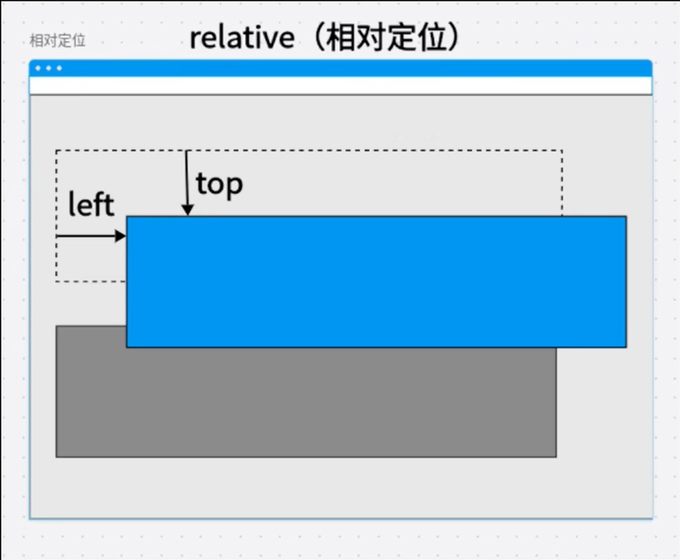

# CSS定位

## static

如果没有给浏览器指定position，默认为`static`定位，这时设置`top`，`bottom`，`left`，`right`都无效。

## relative

相对参照物为自己本身，不会脱离文档流。

## sticky

正常情况，正常布局。当滚动区域超过预设的方位值，表现fixed定位

## fixed

参照物始终为浏览器左上角，脱离文档流会影响其他元素的布局

## position

参照物为最近的一个非static的父容器；如果当前父级未设置定位，会向上层找到；如果都没有找到则以浏览器左上角为参照物。脱离文档流会影响其他元素的布局。

## 参考

https://www.bilibili.com/video/BV1LdkyYaEEg?spm_id_from=333.788.videopod.sections&vd_source=e18cb45c1b6ca497c7dfe825af40b3a0

