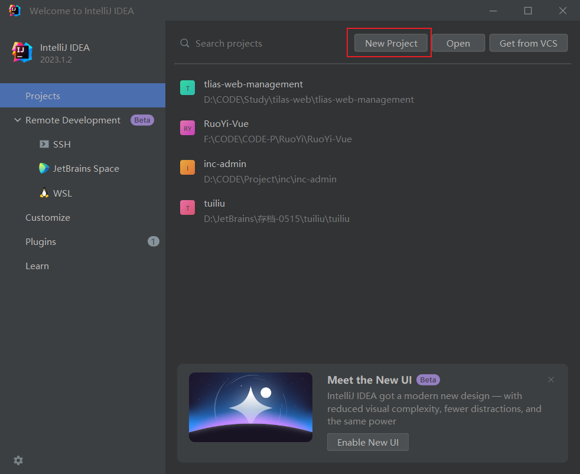

# Springboot工程创建

## 通过IDE创建

选择 Spring Initializr

Web下面选择Spring Web;
Template Englines下面选择Thymeleaf模板；
SQL下面选择MySQL Driver，JDBC API 和 MyBatis Framework；点击Create

## 参考

https://blog.csdn.net/qq_43006591/article/details/106137465

https://blog.csdn.net/weixin_46721191/article/details/130364550

# Springboot项目结构